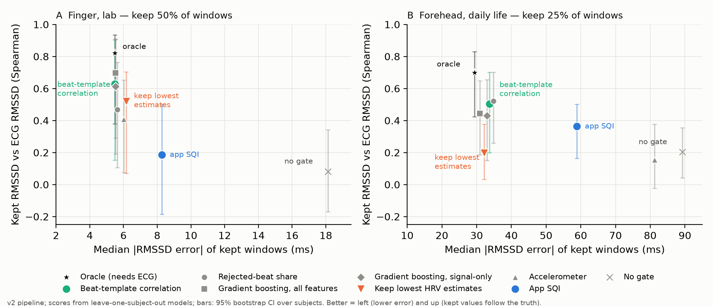

# ppg-sqi-hrv-audit

**When can a PPG-derived HRV value be trusted?** A reproducible study, started from a smart-glasses
prototype app, on two public PPG + ECG datasets: finger in the lab (22 subjects) and forehead in
daily life (all 16 WildPPG participants).

**Short answer.** Judge a quality gate by two things: the error of the windows it keeps, and whether
the kept HRV still **follows the truth**.
- **The best gate was simple.** The correlation of each beat with the window's average beat was the best
  or joint-best gate on both datasets, ahead of the app's signal-quality index (SQI) and on par with ML models.
- **Some gates only look good.** Keeping the lowest HRV estimates looks excellent on error but keeps
  values that barely track the ECG. An accelerometer gate mostly detects rest.
- **At the forehead in daily life, no gate made the values usable.**

The two-page write-up is [`brief/brief.pdf`](brief/brief.pdf).



| Gate (keeps 50% finger / 25% forehead) | Finger: error | Finger: follows ECG (Spearman) | Forehead: error | Forehead: follows ECG |
|---|---|---|---|---|
| No gate | 18.1 ms | 0.08 | 89.2 ms | 0.20 |
| **Beat-template correlation** | **5.5 ms** | **0.63** (0.15–0.90) | 33.7 ms | **0.50** (0.20–0.70) |
| Gradient boosting, all 24 features | 5.5 ms | 0.70 | 30.9 ms | 0.44 |
| Keep lowest HRV estimates | 6.2 ms | 0.52 | 32.2 ms | 0.20 (0.03–0.38) |
| Accelerometer | 6.0 ms | 0.41 | 81.2 ms | 0.15 |
| App SQI | 8.3 ms | 0.19 | 58.9 ms | 0.36 |
| Oracle (needs ECG) | 5.5 ms | 0.82 | 29.4 ms | 0.70 |

All scores are leave-one-subject-out, with 95% CIs from a bootstrap over subjects. Every number comes
from a script in `analysis/` whose output is saved in `analysis/results/`; analyses re-run
bit-identically (hashes in `analysis/README.md`, in Italian).

## How the study got here

1. **The app as deployed.** On the finger data its RMSSD error was 85.5 ms against a true median of
   22.3 ms, and its SQI (threshold 0.4) discarded nothing. See `fig_sqi_tradeoff.png`.
2. **The ceiling of any gate** (`oracle_check.py`). Even a perfect gate could not rescue the app's beat
   detector, because only 1.2% of windows were good. The detector timed beats on the diastolic foot.
3. **v2** (not in the app). Timing beats on the systolic peak cut the finger error to 18.1 ms.
   `calibrate_sqi.py` then calibrates gate thresholds honestly, on held-out subjects.
4. **Quality estimation** (`features.py`, `quality_models.py`). 24 ECG-free features, single-feature
   gates, logistic regression and gradient boosting, all leave-one-subject-out.
5. **Robustness** (`robustness_quality.py`):
   - ranking within one activity and within one person;
   - a no-model "keep lowest estimates" gate, which exposed a circularity at the forehead: there the
     error is mostly the estimate itself;
   - the "kept values follow the truth" criterion.
6. **Uncertainty** (`conformal.py`). Split-conformal intervals whose width adapts to each window reach
   ~89% coverage against a 90% target, even across sites, but only on average: 3/22 and 3/16 people stay
   below 80%.
7. **Explainability** (`explain.py`). SHAP showed the forehead error model relying on the RMSSD estimate
   itself, which prompted the circularity check.

## What is in this repository

| Path | Content |
|---|---|
| `analysis/app_pipeline.py` | Line-by-line Python port of the app's PPG pipeline. The sampling rate is a parameter; `systolic=True` gives v2. |
| `analysis/tests/` | 35 tests. 27 check equivalence with the original Dart code; the rest cover v2, features and the R-peak detector. |
| `analysis/run_analysis.py`, `run_wildppg.py` | First analyses of the app's SQI (finger; forehead on 2 participants). |
| `analysis/oracle_check.py`, `calibrate_sqi.py` | Ceiling of any gate; honest threshold calibration. |
| `analysis/features.py`, `build_features.py` | ECG-free features per one-minute window. |
| `analysis/quality_models.py`, `robustness_quality.py`, `fig_tracking.py` | Quality estimation, robustness checks, brief figure. |
| `analysis/conformal.py`, `explain.py` | Uncertainty (split conformal) and explainability (SHAP). |
| `analysis/ecg_rpeaks.py`, `validate_rpeaks.py` | R-peak detector for WildPPG, validated on manual annotations. |
| `analysis/check_terra_schema.sh` | Checks whether a public wearable-API schema has quality fields. |
| `analysis/results/` | All outputs (JSON, CSV, figures). |
| `brief/` | The brief (Markdown and PDF) and the script that builds the PDF. |
| `docs/PIPELINE_ATTUALE.md` | Detailed description of the app pipeline (in Italian). |

## Reproduce

```bash
cd analysis
python3 -m venv .venv && .venv/bin/pip install -r requirements.txt
./reproduce.sh
```

`reproduce.sh`:
- downloads PTT-PPG (~410 MB, SHA-256 verified) and all 16 WildPPG participants (~19.6 GB transfer, one file at a time, raw files deleted after extraction);
- runs the tests and every analysis, and rebuilds every figure (about 3 h, mostly the WildPPG download,
  which never needs more than ~2.5 GB of free disk at once).

Most analyses only need the saved tables in `analysis/results/`: `quality_models.py`, `robustness_quality.py`,
`conformal.py`, `explain.py` and `fig_tracking.py` run without downloading any data.

## Provenance

The app is a **team project** from the *Smart Wearables Design and Prototyping* course at
Politecnico di Milano (2026): Flutter app and STM32 firmware for glasses with a MAX30101 PPG sensor
and a skin-temperature sensor on the nose bridge. Its source code is **not** included here.

`analysis/dart_ref/ref.dart` runs the app's original Dart classes on seeded synthetic signals. Its
outputs are committed in `analysis/dart_ref/out/`, and the equivalence tests read them from there.
Regenerating them requires the original app sources, so `reproduce.sh` skips that step when they are
missing.

The glasses hardware was returned at the end of the course, so no data from the glasses is included.

## Data and licences

- **Code**: MIT (see `LICENSE`).
- **PTT-PPG**: Mehrgardt P., Khushi M., Poon S., Withana A. *Pulse Transit Time PPG Dataset* (v1.1.0),
  PhysioNet, 2022, https://doi.org/10.13026/jpan-6n92 — Open Data Commons ODbL 1.0.
- **WildPPG**: Meier M., Demirel B. U., Holz C. *WildPPG: A Real-World PPG Dataset of Long Continuous
  Recordings*, NeurIPS 2024 Datasets and Benchmarks — CC BY-NC-SA 4.0 (non-commercial).
  Forehead-derived results (`analysis/results/wildppg_*`, `features_forehead.csv`, `oof_scores_forehead.csv`)
  are shared under the same licence.
- Neither dataset is redistributed here; the scripts download them from the original sources.

## Limitations

- **No data from the glasses**: neither dataset is recorded at the nose bridge.
- **Sample size**: 22 finger subjects and 16 forehead participants, so the CIs are wide. The first SQI analysis
  (`run_wildppg.py`) uses only 2 forehead participants; everything in the brief uses all 16.
- **Polarity**: the polarity of the WildPPG signal is inferred, not documented by its authors.
- **Design choices**: the SQI is an unvalidated heuristic hand-calibrated on the prototype; the 24 features
  are hand-designed; forehead R peaks are detected automatically; v2 is an offline change.

Details in the brief and in `analysis/README.md`.
