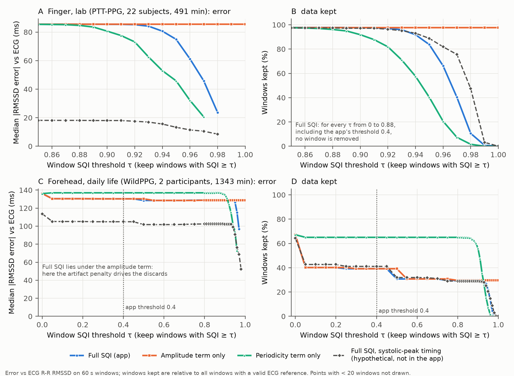

# ppg-sqi-hrv-audit

**Does a PPG signal-quality gate reduce HRV error?** A reproducible audit of the signal-processing
pipeline of a smart-glasses prototype app, on two public PPG + ECG datasets.

Short answer: **no**. At its deployed threshold, the app's signal-quality index (SQI):
- **finger, lab**: never fired;
- **forehead, daily life**: discarded 42% of the data without meaningfully reducing the error.

In both cases the RMSSD error comes from beat detection, which the SQI does not measure.
The two-page write-up is in [`brief/brief.pdf`](brief/brief.pdf).



## Key results

Median absolute RMSSD error against ECG, 60 s windows (95% bootstrap CIs):

| | Windows kept | Median abs. RMSSD error |
|---|---|---|
| **Finger, lab** (PTT-PPG, 22 subjects, 491 windows; true RMSSD median 22.3 ms) — app pipeline | 97.8% | 85.5 ms (65.7–101.5) |
| + SQI ≥ 0.4 (the app's threshold) | 97.8% | 85.5 ms (no change) |
| Systolic-peak beat timing (offline variant, not in the app) | 97.4% | 18.1 ms (10.0–34.0) |
| **Forehead, daily life** (WildPPG, 2 participants, 1,343 windows; true median 14.8 ms) — app pipeline | 67.2% | 136.1 ms (128.5–144.0) |
| + SQI ≥ 0.4 | 39.2% | 130.3 ms (reduction CI −1.6 to 10.5 ms) |

Every number in the brief comes from a script in `analysis/` whose output is saved in
`analysis/results/`. Both analyses re-run bit-identically; SHA-256 hashes are listed in
[`analysis/README.md`](analysis/README.md).

## What is in this repository

| Path | Content |
|---|---|
| `analysis/app_pipeline.py` | Line-by-line Python port of the app's PPG pipeline: band-pass filter, peak detector, RR acceptance, RMSSD and SQI. The sampling rate is a parameter. |
| `analysis/tests/` | 30 tests. 27 check equivalence with the original Dart code (see Provenance); the rest cover the ECG R-peak detector and options. |
| `analysis/run_analysis.py` | Finger analysis (PhysioNet PTT-PPG). |
| `analysis/run_wildppg.py`, `analysis/wildppg_channel_check.py` | Forehead analysis (WildPPG). |
| `analysis/ecg_rpeaks.py`, `analysis/validate_rpeaks.py` | R-peak detector for WildPPG, validated against manual annotations. |
| `analysis/fiducial_check.py` | Where the detected PPG beats fall relative to the ECG R wave. |
| `analysis/check_terra_schema.sh` | Checks whether a public wearable-API schema has quality fields. |
| `analysis/results/` | All outputs: JSON, CSV, figure. |
| `brief/` | The brief (Markdown and PDF) and the script that builds the PDF. |
| `docs/PIPELINE_ATTUALE.md` | Detailed description of the app pipeline, with file:line references to the original app (in Italian). |

`analysis/README.md` has the full method, all results and the dataset choice. It is in Italian.

## Reproduce

```bash
cd analysis
python3 -m venv .venv && .venv/bin/pip install -r requirements.txt
./reproduce.sh
```

`reproduce.sh`:
- downloads PTT-PPG (~410 MB, SHA-256 verified) and 2 WildPPG participants (~2.2 GB transfer, raw files deleted after extraction);
- runs the tests and both analyses;
- rebuilds the figure.

`./download_wildppg.sh all` fetches all 16 WildPPG participants (19.6 GB).

## Provenance

The app is a **team project** from the *Smart Wearables Design and Prototyping* course at
Politecnico di Milano (2026): Flutter app and STM32 firmware for glasses with a MAX30101 PPG sensor
and a skin-temperature sensor on the nose bridge. Its source code is **not** included here.

`analysis/dart_ref/ref.dart` runs the app's original Dart classes on seeded synthetic signals. Its
outputs are committed in `analysis/dart_ref/out/`, and the equivalence tests read them from there.
Regenerating them requires the original app sources, so `reproduce.sh` skips that step when they are
missing.

The glasses hardware was returned at the end of the course, so no data from the glasses is included.

## Data and licences

- **Code**: MIT (see `LICENSE`).
- **PTT-PPG**: Mehrgardt P., Khushi M., Poon S., Withana A. *Pulse Transit Time PPG Dataset* (v1.1.0),
  PhysioNet, 2022, https://doi.org/10.13026/jpan-6n92 — Open Data Commons ODbL 1.0.
- **WildPPG**: Meier M., Demirel B. U., Holz C. *WildPPG: A Real-World PPG Dataset of Long Continuous
  Recordings*, NeurIPS 2024 Datasets and Benchmarks — CC BY-NC-SA 4.0 (non-commercial).
  `analysis/results/wildppg_*` are derived from WildPPG and are shared under the same licence.
- Neither dataset is redistributed here; the scripts download them from the original sources.

## Limitations

- **No data from the glasses**: neither dataset is recorded at the nose bridge.
- **Forehead sample**: only 2 of 16 WildPPG participants. The CIs describe variation within these two
  people, not between people.
- **Polarity**: the polarity of the WildPPG signal is inferred, not documented by its authors.
- **The SQI** is an unvalidated heuristic hand-calibrated on the prototype.

Details in the brief and in `analysis/README.md`.
