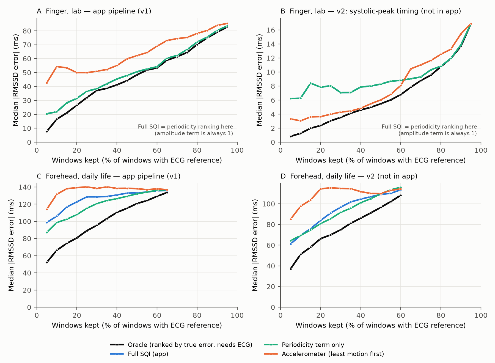
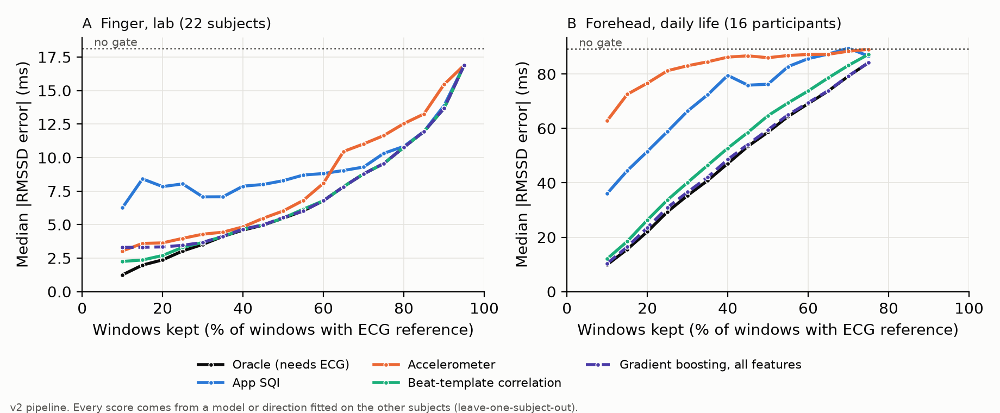

# ppg-sqi-hrv-audit

**Does a PPG signal-quality gate reduce HRV error?** A reproducible audit of the signal-processing
pipeline of a smart-glasses prototype app, on two public PPG + ECG datasets.

Short answer: **not as deployed, and not before the beats are timed correctly.**
- **As deployed**, the app's signal-quality index (SQI) never fired on finger data. At the forehead,
  in daily life, it discarded 42% of the data without meaningfully reducing the error.
- **Even a perfect gate** cannot rescue the app's beat detector: with it, only 1% of windows are good.
- **Timing beats on the systolic peak** cut the finger RMSSD error from 85.5 to 18.1 ms. After that, a
  gate calibrated on other subjects halves it again: 8.5 ms with the SQI, 6.0 ms with an accelerometer.
- **At the forehead, in daily life,** nothing worked.

The two-page write-up is in [`brief/brief.pdf`](brief/brief.pdf).



## Key results

Median absolute RMSSD error against ECG, 60 s windows (95% bootstrap CIs):

| | Windows kept | Median abs. RMSSD error |
|---|---|---|
| **Finger, lab** (PTT-PPG, 22 subjects, 491 windows; true RMSSD median 22.3 ms) — app pipeline | 97.8% | 85.5 ms (65.7–101.5) |
| + SQI ≥ 0.4 (the app's threshold) | 97.8% | 85.5 ms (no change) |
| Systolic-peak beat timing (offline variant, not in the app) | 97.4% | 18.1 ms (10.0–34.0) |
| **Forehead, daily life** (WildPPG, 2 participants, 1,343 windows; true median 14.8 ms) — app pipeline | 67.2% | 136.1 ms (128.5–144.0) |
| + SQI ≥ 0.4 | 39.2% | 130.3 ms (reduction CI −1.6 to 10.5 ms) |

Every number in the brief comes from a script in `analysis/` whose output is saved in
`analysis/results/`. Both analyses re-run bit-identically; SHA-256 hashes are listed in
[`analysis/README.md`](analysis/README.md).

## Follow-up: was the gate wrong, or can no gate help?

Two further tests, now also in the brief. Details in `analysis/README.md` §9.

**Test 1: the ceiling.** An oracle keeps the windows with the lowest *true* error. It needs the
ECG, so it is unreachable, but it shows the best any gate could do.
- *Finger*: ranked by the app's SQI, the error at half the data is 50.6 ms, against 48.4 ms for the
  oracle. The ranking was close to the ceiling; the threshold of 0.4 was the problem.
- *App pipeline*: even a perfect gate cannot help much, because only 1.2% of finger windows and 0% of
  forehead windows have an error ≤ 5 ms.

**Test 2: honest calibration.** Thresholds are chosen on 11 subjects and tested on the other 11, over
200 random splits.
- The pipeline is **v2**: the same app pipeline, with beats timed on the systolic peak (not in the app).
- Keeping half the data on unseen subjects, the error falls from 18.0 to **8.5 ms** with the SQI, and to
  **6.0 ms** with an accelerometer gate. The oracle reaches 5.5 ms.
- At the forehead, thresholds transfer neither between participants nor from the finger.

**Conclusion.** Fix beat timing first. A gate calibrated against a reference then roughly halves the
error for half the data, and in the lab a plain accelerometer gate does at least as well.

The earlier threshold sweep is in `analysis/results/fig_sqi_tradeoff.png`.

## Which signal best identifies good windows? ML, uncertainty, explainability

Starting from v2, every one-minute window gets 24 features computed **without the ECG**: the app's SQI
and its parts, beat statistics, beat-to-template correlation, waveform shape and accelerometer. The ECG
only provides the label (the RMSSD error). The forehead now uses **all 16 WildPPG participants**:
10,945 windows with a reliable reference.

All scores are leave-one-subject-out. Full tables in `analysis/README.md` §10 (Italian).

| | Finger: AURC (gap closed) | Finger: AUROC | Forehead: AURC (gap closed) | Forehead: AUROC |
|---|---|---|---|---|
| No gate | 18.1 | — | 89.2 | — |
| Oracle (needs ECG) | 6.9 (100%) | — | 48.8 (100%) | — |
| Gradient boosting, all features | 7.1 (98%) | 0.96 | **49.6 (98%)** | 0.98 |
| Beat-template correlation alone | **7.0 (99%)** | 0.97 | 53.3 (89%) | 0.96 |
| Accelerometer | 8.1 (89%) | 0.88 | 82.8 (16%) | 0.62 |
| App SQI | 9.4 (78%) | 0.68 | 71.0 (45%) | 0.39 |

AURC is the mean median |RMSSD error| (ms) along the error–coverage curve; "gap closed" is the
share of the distance between no gate and the oracle that a method recovers.

- **Finger, lab**: a single interpretable feature, beat-template correlation, nearly matches the
  oracle. ML adds nothing.
- **Forehead, daily life**: gradient boosting recovers 98% of the gap. The app SQI is worse than
  chance at spotting good windows, and the accelerometer does not help.
- **Transfer**: a model trained only on finger data scores forehead windows almost as well (AURC 49.9
  vs 49.6). What transfers is the ranking, not a fixed threshold.
- **Caveats**:
  - even the oracle keeps 29 ms of error at 25% of forehead data;
  - on the finger, gated windows have higher true HRV (sitting), so gated HRV over-represents rest.
- **Uncertainty (split conformal)**: adaptive intervals reach ~89% coverage against a 90% target, also
  when calibrated on the other site; constant-width intervals drop to 68% from finger to forehead. The
  guarantee is marginal: 3 of 22 finger subjects and 3 of 16 forehead participants stay below 80%.
  Forehead intervals are honest but wide (median 223 ms).
- **Explainability (SHAP)**: finger errors are explained by beat-template correlation; forehead errors
  by the inflated RMSSD estimate itself and large RR jumps. Dropping the RMSSD feature leaves
  performance unchanged, so SHAP importance is not necessity.



## What is in this repository

| Path | Content |
|---|---|
| `analysis/app_pipeline.py` | Line-by-line Python port of the app's PPG pipeline: band-pass filter, peak detector, RR acceptance, RMSSD and SQI. The sampling rate is a parameter. |
| `analysis/tests/` | 35 tests. 27 check equivalence with the original Dart code (see Provenance); the rest cover the ECG R-peak detector, options and v2. |
| `analysis/run_analysis.py` | Finger analysis (PhysioNet PTT-PPG). |
| `analysis/run_wildppg.py`, `analysis/wildppg_channel_check.py` | Forehead analysis (WildPPG). |
| `analysis/ecg_rpeaks.py`, `analysis/validate_rpeaks.py` | R-peak detector for WildPPG, validated against manual annotations. |
| `analysis/fiducial_check.py` | Where the detected PPG beats fall relative to the ECG R wave. |
| `analysis/oracle_check.py`, `analysis/calibrate_sqi.py` | Follow-up tests 1 and 2. |
| `analysis/features.py`, `analysis/build_features.py`, `analysis/quality_models.py`, `analysis/conformal.py`, `analysis/explain.py` | Quality estimation: features, models, conformal intervals, SHAP. |
| `analysis/check_terra_schema.sh` | Checks whether a public wearable-API schema has quality fields. |
| `analysis/results/` | All outputs: JSON, CSV, figure. |
| `brief/` | The brief (Markdown and PDF) and the script that builds the PDF. |
| `docs/PIPELINE_ATTUALE.md` | Detailed description of the app pipeline, with file:line references to the original app (in Italian). |

`analysis/README.md` has the full method, all results and the dataset choice. It is in Italian.

## Reproduce

```bash
cd analysis
python3 -m venv .venv && .venv/bin/pip install -r requirements.txt
./reproduce.sh
```

`reproduce.sh`:
- downloads PTT-PPG (~410 MB, SHA-256 verified) and all 16 WildPPG participants (~19.6 GB transfer, one file at a time, raw files deleted after extraction);
- runs the tests and both analyses;
- rebuilds the figure.

`./download_wildppg.sh all` fetches all 16 WildPPG participants (19.6 GB).

## Provenance

The app is a **team project** from the *Smart Wearables Design and Prototyping* course at
Politecnico di Milano (2026): Flutter app and STM32 firmware for glasses with a MAX30101 PPG sensor
and a skin-temperature sensor on the nose bridge. Its source code is **not** included here.

`analysis/dart_ref/ref.dart` runs the app's original Dart classes on seeded synthetic signals. Its
outputs are committed in `analysis/dart_ref/out/`, and the equivalence tests read them from there.
Regenerating them requires the original app sources, so `reproduce.sh` skips that step when they are
missing.

The glasses hardware was returned at the end of the course, so no data from the glasses is included.

## Data and licences

- **Code**: MIT (see `LICENSE`).
- **PTT-PPG**: Mehrgardt P., Khushi M., Poon S., Withana A. *Pulse Transit Time PPG Dataset* (v1.1.0),
  PhysioNet, 2022, https://doi.org/10.13026/jpan-6n92 — Open Data Commons ODbL 1.0.
- **WildPPG**: Meier M., Demirel B. U., Holz C. *WildPPG: A Real-World PPG Dataset of Long Continuous
  Recordings*, NeurIPS 2024 Datasets and Benchmarks — CC BY-NC-SA 4.0 (non-commercial).
  Forehead-derived results (`analysis/results/wildppg_*`, `features_forehead.csv`, `oof_scores_forehead.csv`)
  are shared under the same licence.
- Neither dataset is redistributed here; the scripts download them from the original sources.

## Limitations

- **No data from the glasses**: neither dataset is recorded at the nose bridge.
- **Forehead sample**: the brief and the first analyses use 2 of 16 WildPPG participants; the quality-model
  section uses all 16.
- **Polarity**: the polarity of the WildPPG signal is inferred, not documented by its authors.
- **The SQI** is an unvalidated heuristic hand-calibrated on the prototype.

Details in the brief and in `analysis/README.md`.
