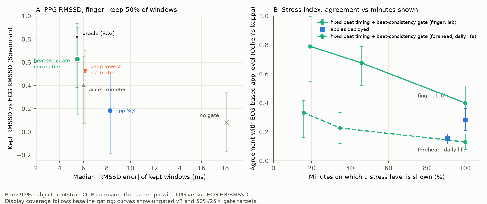

# ppg-sqi-hrv-audit

**Can a smart-glasses stress index trust its heart-rate variability?** In the *Smart Wearables Design
and Prototyping* course (Politecnico di Milano) our team built smart glasses with a PPG sensor on the
nose bridge and a phone app that turns heart rate and HRV (RMSSD) into a stress index. The glasses were
returned after the exam. This repository continues the work offline, on two public PPG + ECG datasets:
finger in the lab (22 subjects) and forehead in daily life (all 16 WildPPG participants).

**Short answer.**
- **Fix beat timing first.** The app timed beats on the diastolic foot of the pulse; its RMSSD was off
  by 85.5 ms against a true median of 22.3 ms. Timing beats on the systolic peak cut this to 18.1 ms.
- **Then trust only beat-consistent minutes.** How similar each beat is to the window's average beat was
  the best of 24 ECG-free quality signals, better than the app's signal-quality index (SQI).
- **What reaches the stress index.** Compared with the level the app would show from ECG-derived HR/HRV,
  the app as deployed agreed with kappa 0.28 on the finger, with false alarms in 31% of calm minutes.
  With fixed timing and a beat-consistency gate, agreement was 0.68 on 46% of minutes. At the forehead in
  daily life it never exceeded 0.33.
- **Uncertainty.** Calibrated intervals were honest but could only confirm "calm".

The two-page write-up is [`brief/brief.pdf`](brief/brief.pdf).



| Stress level shown vs ECG-based level | Minutes shown | Cohen's kappa (95% CI) | False alarms |
|---|---|---|---|
| Finger, lab — app as deployed | 100% | 0.28 (0.21–0.36) | 31% |
| Finger — fixed beat timing | 100% | 0.40 (0.29–0.52) | 25% |
| Finger — fixed timing + beat-consistency gate | 46% | 0.68 (0.52–0.79) | 13% |
| Forehead, daily life — app as deployed | 91% | 0.15 (0.12–0.19) | 43% |
| Forehead — fixed timing + beat-consistency gate | 16% | 0.33 (0.16–0.42) | 36% |

The reference is the app's own stress index computed from ECG-derived HR/HRV, i.e. what the app would
show with perfect beats. It is not an independent stress measure. Every number comes from a script in
`analysis/` whose output is saved in `analysis/results/`; analyses re-run bit-identically (hashes in
`analysis/README.md`, in Italian).

## How the study got here

1. **The app as deployed** (`run_analysis.py`, `run_wildppg.py`). Large RMSSD error; the SQI (threshold
   0.4) discarded nothing on finger data.
2. **Ceiling of any gate** (`oracle_check.py`). Even a perfect gate could not rescue the app's beat
   detector: only 1.2% of windows were good. The detector timed beats on the diastolic foot.
3. **v2** (not in the app). Beats timed on the systolic peak; `calibrate_sqi.py` calibrates gate
   thresholds on held-out subjects.
4. **Which signal tells when to trust HRV** (`features.py`, `quality_models.py`, `robustness_quality.py`).
   24 ECG-free features, single features and ML models, all leave-one-subject-out.
   - Beat-template correlation is the best or joint-best gate, and it works within one activity.
   - A "keep lowest estimates" rule looks as good on error but its kept values do not follow the ECG.
     SHAP (`explain.py`) pointed to this circularity.
5. **What reaches the stress index** (`stress.py`, `build_stress.py`, `stress_eval.py`). The app's stress
   index, verified against the original Dart, is replayed second by second on both datasets.
6. **Uncertainty** (`conformal.py`, `stress_eval.py`). Split-conformal intervals keep ~90% coverage on
   average, but not per person. On the stress score, "confident" levels were almost always "calm": at the
   forehead they did no better than always answering "calm" (kappa 0.03).

## What is in this repository

| Path | Content |
|---|---|
| `analysis/app_pipeline.py`, `analysis/stress.py` | Line-by-line Python ports of the app's PPG pipeline (`systolic=True` gives v2) and stress index. |
| `analysis/tests/` | 39 tests: equivalence with the original Dart code (pipeline and stress index), v2, features, R-peak detector. |
| `analysis/run_analysis.py`, `run_wildppg.py`, `oracle_check.py`, `calibrate_sqi.py` | First analyses of the app's SQI; ceiling of any gate; honest threshold calibration. |
| `analysis/features.py`, `build_features.py`, `quality_models.py`, `robustness_quality.py` | ECG-free quality features, models and robustness checks. |
| `analysis/build_stress.py`, `stress_eval.py`, `fig_brief.py` | Stress-index replay and evaluation; brief figure. |
| `analysis/conformal.py`, `explain.py` | Uncertainty (split conformal) and explainability (SHAP). |
| `analysis/ecg_rpeaks.py`, `validate_rpeaks.py` | R-peak detector for WildPPG, validated on manual annotations. |
| `analysis/check_terra_schema.sh` | Checks whether a public wearable-API schema has quality fields. |
| `analysis/results/` | All outputs (JSON, CSV, figures). |
| `brief/` | The brief (Markdown and PDF) and the script that builds the PDF. |
| `docs/PIPELINE_ATTUALE.md` | Detailed description of the app pipeline (in Italian). |

## Reproduce

```bash
cd analysis
python3 -m venv .venv && .venv/bin/pip install -r requirements.txt
./reproduce.sh
```

`reproduce.sh`:
- downloads PTT-PPG (~410 MB, SHA-256 verified) and all 16 WildPPG participants (~19.6 GB transfer, one file at a time, raw files deleted after extraction);
- runs the tests and every analysis, and rebuilds every figure (about 3 h, mostly the WildPPG download,
  which never needs more than ~2.5 GB of free disk at once).

Most analyses only need the saved tables in `analysis/results/`: `quality_models.py`, `robustness_quality.py`,
`conformal.py`, `explain.py`, `stress_eval.py`, `fig_tracking.py` and `fig_brief.py` run without downloading any data.

## Provenance

The app is a **team project** from the *Smart Wearables Design and Prototyping* course at
Politecnico di Milano (2026): Flutter app and STM32 firmware for glasses with a MAX30101 PPG sensor
and a skin-temperature sensor on the nose bridge. Its source code is **not** included here.

`analysis/dart_ref/ref.dart` runs the app's original Dart classes on seeded synthetic signals. Its
outputs are committed in `analysis/dart_ref/out/`, and the equivalence tests read them from there.
Regenerating them requires the original app sources, so `reproduce.sh` skips that step when they are
missing.

The glasses hardware was returned at the end of the course, so no data from the glasses is included.

## Data and licences

- **Code**: MIT (see `LICENSE`).
- **PTT-PPG**: Mehrgardt P., Khushi M., Poon S., Withana A. *Pulse Transit Time PPG Dataset* (v1.1.0),
  PhysioNet, 2022, https://doi.org/10.13026/jpan-6n92 — Open Data Commons ODbL 1.0.
- **WildPPG**: Meier M., Demirel B. U., Holz C. *WildPPG: A Real-World PPG Dataset of Long Continuous
  Recordings*, NeurIPS 2024 Datasets and Benchmarks — CC BY-NC-SA 4.0 (non-commercial).
  Forehead-derived results (`analysis/results/wildppg_*`, `features_forehead.csv`, `oof_scores_forehead.csv`, `stress_forehead.csv`)
  are shared under the same licence.
- Neither dataset is redistributed here; the scripts download them from the original sources.

## Limitations

- **No data from the glasses**: neither dataset is recorded at the nose bridge.
- **Sample size**: 22 finger subjects and 16 forehead participants, so the CIs are wide. The first SQI analysis
  (`run_wildppg.py`) uses only 2 forehead participants; everything in the brief uses all 16.
- **Polarity**: the polarity of the WildPPG signal is inferred, not documented by its authors.
- **Stress reference**: the app's own stress index on ECG-derived HR/HRV, not a validated stress measure.
- **Design choices**: the SQI is an unvalidated heuristic hand-calibrated on the prototype; the 24 features
  are hand-designed; forehead R peaks are detected automatically; v2 is an offline change.

Details in the brief and in `analysis/README.md`.
